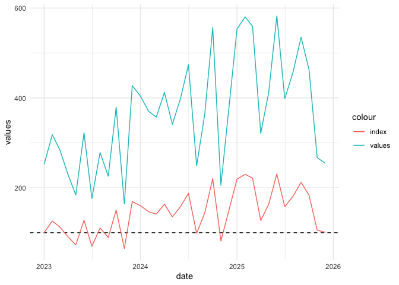
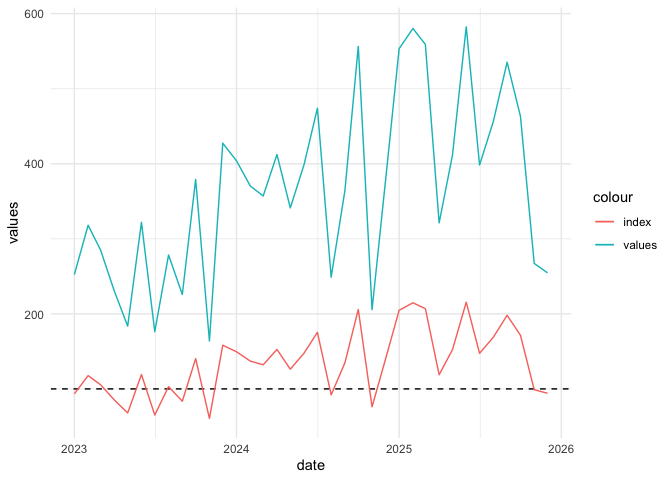
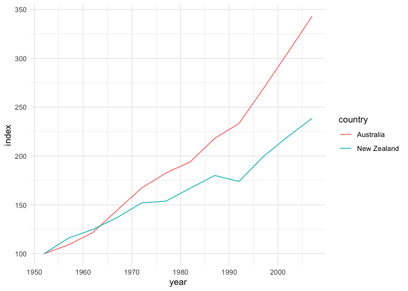

Indexing function
================
Javier Mtz.-Rdz.

# Setup

For this assignment, we will need to load the following packages.

``` r
library(tidyverse)
library(rlang)
library(gapminder)
library(testthat)
```

# Exercise 1-2: Make and Document your Function

In this section, I developed a function to create an index within a tidy
dataset.

``` r
#' Indexing a series
#'
#' This function generates an index from a variable based on a specified 
#' observation(s).
#'
#' @param .x Tidy dataset (justification: x can be confused with 
#'            a parameter. So, I thought that .x could be a better
#'            idea)
#' @param col_from Column of a numeric variable to be indexed
#'                  (justification: short form for "column 
#'                  from which we will generate the index")
#' @param col_to Column to store the result (default is 'index').
#'                  (justification: short form to refer to the 
#'                  generated function).
#' @param ... Components to select the base observation(s)
#' @param n_base Base value for the index (default is 100)
#'                  (justification: short form for "base number").
#'
#' @importFrom magrittr %>%
#' @importFrom rlang !!
#' @importFrom rlang :=
#' @return Returns the dataset with the indexed column
#' @export
indexing <- function (.x, col_from,
                      ...,
                      col_to = index, 
                      n_base = 100) 
{
    cf <- rlang::enquo(col_from)
    ct <- rlang::enquo(col_to)
    group_vars <- rlang::enquos(...)
    
    if(!is.numeric(.x %>% dplyr::pull(!!cf))) {
stop(paste0("'", dplyr::as_label(cf),
"' is not a numeric variable."))
    }
    
    
    
    rows <- .x %>%
      dplyr::filter(!!!group_vars) %>%
      dplyr::mutate(rows = n()) %>% 
      dplyr::pull(rows) %>% 
      ifelse(identical(., integer(0)),
             ., max(.))
    
    if (is.na(rows)) stop("Reference not found.")
    
    if (rows > 1) warning("More than one row is being used as a reference.")
    
    
    
    .x <- .x %>%
      dplyr::mutate(!!ct := (!!cf*n_base)/ifelse(
        sum(ifelse(!!!group_vars,
                   1, 0)) == 1,
        sum(ifelse(!!!group_vars ,
                   !!cf, 0)),
        sum(ifelse(!!!group_vars ,
                   !!cf, 0))/sum(ifelse(!!!group_vars ,
                                        1, 0))
      ))
    
    
    return(.x)
}
```

# Exercise 3: Include examples

## Example 1:

In this example, I generated a time series and established an index
using the `values` column. The base observation is set at `2023-01-01`.
Then, I created a plot to compare the original column and the indexed
one.

``` r
# Toy dataset
set.seed(545)

df <- tibble(date = seq(as.Date("2023-01-01"), 
                        as.Date("2025-12-01"),
                        "month"),
             values = runif(12*3, 50, 150)*
               (2 + cumsum(runif(12*3, 0, 0.15))))

# Index generation 

d2 <- df %>% 
  indexing(values,
           date == as.Date("2023-01-01"))

# Comparing original variable vs. indexed variable.

d2 %>% 
  ggplot(aes(x = date)) +
  geom_hline(yintercept = 100,
             linetype = "dashed") +
  geom_line(aes(y = values,
                color = "values")) +
  geom_line(aes(y = index,
                color = "index")) +
  theme_minimal()
```

<!-- -->

## Example 2:

Using the toy dataset from earlier, this code chunk generates an indexed
variable containing the average values of multiple observations.
Specifically, it calculates an average for the year 2023. This returns a
warning to avoid cases where it was not the intention.

``` r
d2 <- df %>% 
  indexing(values,
           year(date) == 2023)
```

    ## Warning in indexing(., values, year(date) == 2023): More than one row is being
    ## used as a reference.

``` r
# Comparing original variable vs. indexed variable.

d2 %>% 
  ggplot(aes(x = date)) +
  geom_hline(yintercept = 100,
             linetype = "dashed") +
  geom_line(aes(y = values,
                color = "values")) +
  geom_line(aes(y = index,
                color = "index")) +
  theme_minimal()
```

<!-- -->

## Example 3:

In this section, I indexed the GDP per capita for Oceania countries
taking the year 1952 as the base. Afterwards, I examined the progression
over time.

``` r
idx_gap <- gapminder %>% 
  filter(continent == "Oceania") %>% 
  group_by(country) %>% 
  indexing(gdpPercap,
            year == 1952) 

idx_gap %>% 
    ggplot(aes(x = year, 
             y = index,
             color = country)) +
  geom_line() +
  theme_minimal()
```

<!-- -->

# Exercise 4: Test the Function

In this section, I tested the `indexing()` function using the toy
dataset.

``` r
test_that("Testing indexing() function", {
  # This test verifies that the returned data frame contains the right information.
  indexing(df,
           values,
           date == as.Date("2023-01-01")) %>% 
    expect_s3_class("data.frame") %>% 
    expect_length(3) %>% 
    pull(index) %>% 
    last() %>% 
    round() %>% 
    expect_equal(101)
  # This test evaluates the error when a non numeric variable is provided
  expect_error(indexing(df,
                        date,
                        date == as.Date("2023-01-01")), 
               "'date' is not a numeric variable.")
  # This test evaluates the error when reference is not found
  expect_error(indexing(df,
                        values,
                        date == as.Date("2021-01-01")), 
               "Reference not found.")
  # This test evaluates the warning when More than one row is being used as a reference period.
  expect_warning(indexing(df,
                        values,
                        year(date) == 2023), 
               "More than one row is being used as a reference.")
  
})
```

    ## Test passed 🥇
